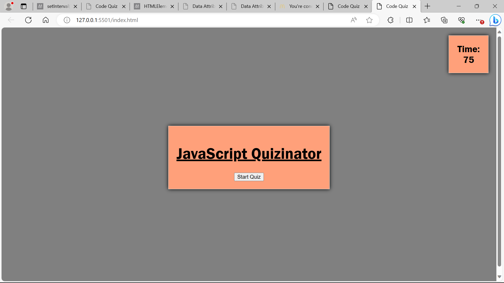
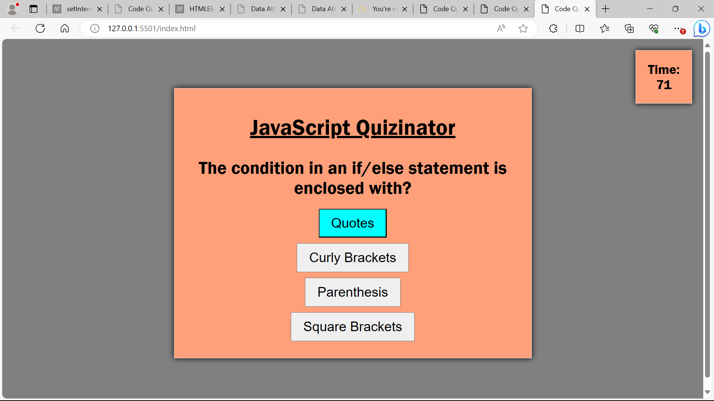
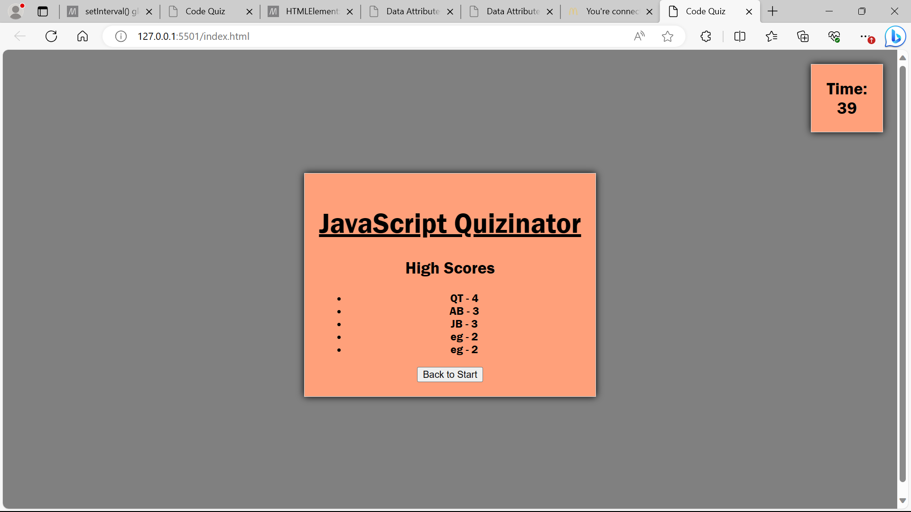

## JavaScript Quizinator  

# A simple JavaScript timed quiz with highscore inputs built using HTML, CSS, and JavaScript.

JavaScript Quizinator Application Screenshots

Features: This JavaScript quiz features a timer, multiple choice prompts, and Highscore page with user intials inputs. 
Getting Started: Prerequisites Web browsers including Chrome, Firefox, Safari Usage: Clone the repository bash Copy code git clone INSERT DEPLOY LINK HERE
Open index.html in your browser. Select your answer based on the JavaScript question. At the end of the quiz you will be promoted to enter your intitials in the highscore section.Contributing: Contributions are always welcome! Please read my contributing guidelines to get started.

License This project is licensed under the MIT License - see the LICENSE.md file for details.

Acknowledgments: Thanks to theses resources for information crucial to this project.Udemy,Youtube/Mosh,BCS,ChatGPT. [https://www.udemy.com/ , https://www.youtube.com/ , https://bootcampspot.com , https://chat.openai.com/, https://www.w3schools.com/]
